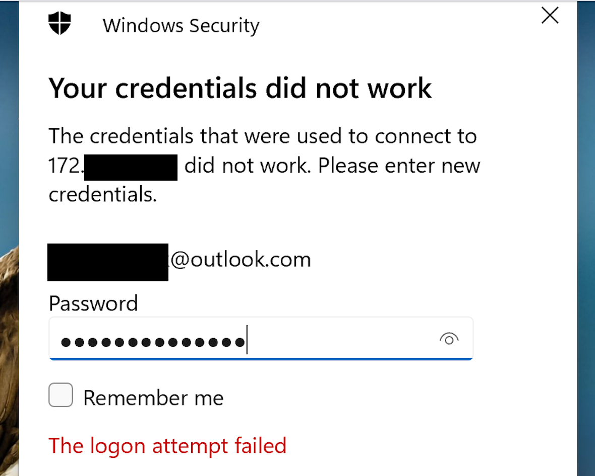

# RDP Old Password Vulnerability Workaround Report 
Prepared by: Tessa Anselm
Date: May 7, 2025

**Overview**
This report documents a discovered workaround for a known vulnerability in Microsoft Windows Remote Desktop Protocol (RDP) involving Microsoft Cloud accounts. The vulnerability allows users to log in using old, revoked passwords even after the password has been updated, exposing systems to potential unauthorized access. However, a practical workaround involving resetting the user’s PIN has been identified, effectively mitigating the issue.

Reference:
•	News Article: Ars Technica, [”Windows RDP lets you log in using revoked passwords. Microsoft is OK with that”](https://arstechnica.com/security/2025/04/windows-rdp-lets-you-log-in-using-revoked-passwords-microsoft-is-ok-with-that/) (April 30, 2025)

 ---
**Vulnerability Description**
The vulnerability arises from the way Windows handles cached credentials for Microsoft Cloud accounts used over RDP. When a user changes their cloud password, the old password may still be accepted during RDP logins due to credential caching, even after the password change has propagated to the Microsoft cloud. 

 ---
 
**Observed Behavior**
During the lab exercise (H 540: RDP and Old Passwords), the following behavior was observed:
Reference:
•	Project Lab: ”[H 540: RDP and Old Passwords](https://samsclass.info/123/proj14/H540.htm)” (Sam Bowne’s Projects)
•	A Microsoft cloud account (e.g., Hotmail, Outlook) added to a Windows machine as an administrator could still authenticate using an old password after the password was changed in the cloud. I had removed administrator access but this vulnerability is still persistent.
•	Clearing the local cached credentials and adjusting the Group Policy settings to prevent cached logons did not fully mitigate the issue.
•	The old password remained valid for RDP sessions, representing a critical security flaw.

 ---
 
**Workaround Discovery**
After extensive testing, the following workaround was identified:
1.	Resetting the PIN for the Microsoft Cloud Account:
o	Navigate to Settings → Accounts → Sign-in options.
o	Click I forgot my PIN.
o	Follow the prompts to reset the PIN associated with the Microsoft cloud account.
o	This process effectively clears the cached credentials and forces the account to re-authenticate with the updated password.

 

2.	Impact of Workaround:
o	This approach successfully invalidated the old password for RDP logins, resolving the vulnerability without requiring complex Group Policy changes or Credential Manager adjustments.
o	It appears that resetting the PIN refreshes the cached authentication token, effectively clearing any outdated credentials.
 
---

**Conclusion**
This workaround provides a simple yet effective method to address this critical security flaw in Windows RDP. It can be quickly implemented without requiring significant infrastructure changes, making it a practical solution for organizations concerned about the security of their cloud-integrated Windows environments.

 ---
 
**Recommendations**
•	Implement this workaround as a temporary measure while a more permanent fix is evaluated.
•	Regularly review and clear cached credentials for critical accounts.
•	Consider additional RDP security measures, such as multifactor authentication (MFA) and restricted network access.

 ---
**Next Steps**
Further research is recommended to confirm the long-term effectiveness of this approach and identify any potential side effects.

---
 
